# T06 - Signatura Electrònica
## SMX 2A | Edu Gordo

---

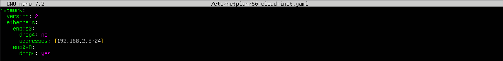

Modifiquem el fitxer **/etc/netplan/50-cloud-init.yaml** per assignar una IP estàtica a **enp0s3** i habilitar DHCP a **enp0s8**.

---

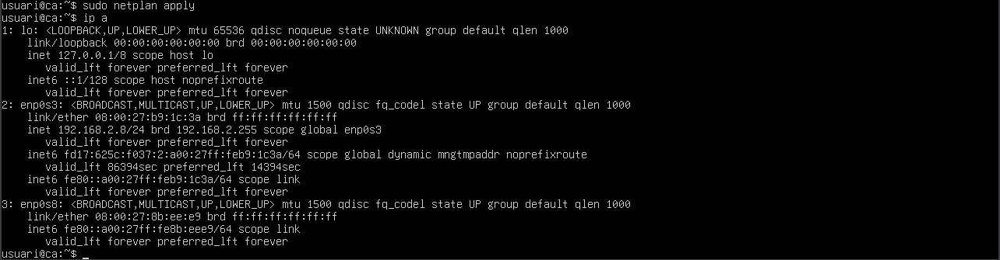

Apliquem la configuració de **Netplan** i comprovem que les interfícies **enp0s3** i **enp0s8** han rebut correctament les seues adreces IP.

---

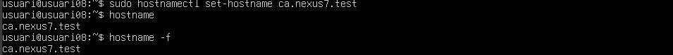

Canviem el hostname del sistema a **ca.nexus7.test** i verifiquem que s’ha aplicat correctament amb hostname i hostname -f.

---

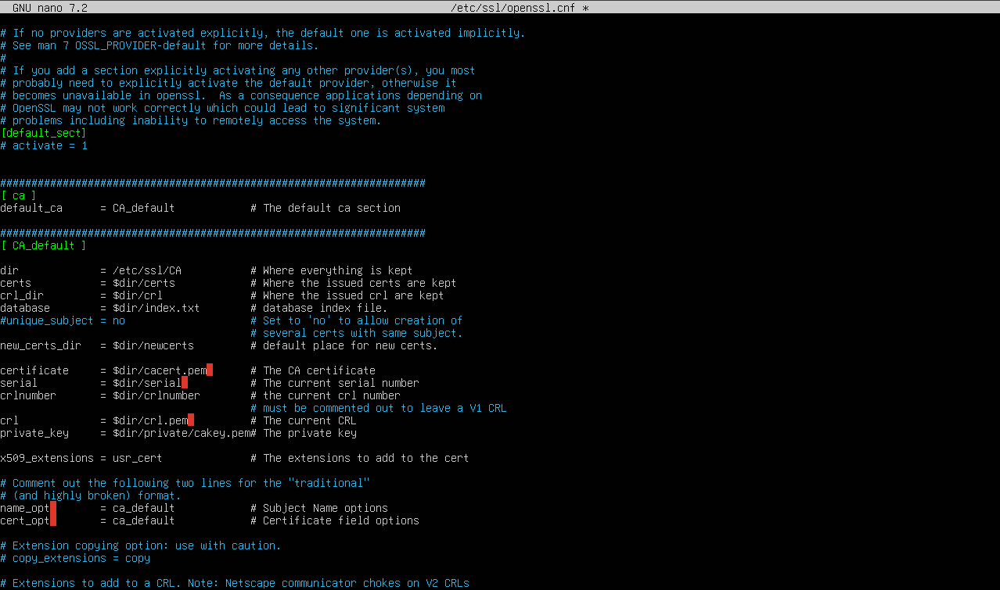

Editem el fitxer **/etc/ssl/openssl.cnf** per configurar els paràmetres i rutes predeterminades utilitzats en la generació de certificats SSL.

---

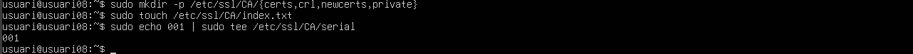

Creem l’estructura de directoris de la **CA** a /etc/ssl/CA, inicialitzem el fitxer index.txt i establim el número de sèrie inicial dels certificats a 001.

---

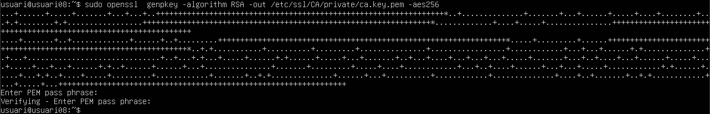

Generem la **clau privada RSA** de la nostra Autoritat Certificadora i la protegem amb xifrat **AES‑256** introduint una contrasenya PEM.

---

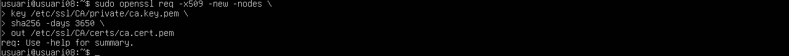

Generem el **certificat autosignat de la nostra CA** amb openssl req, utilitzant la clau privada ca.key.pem, signant-lo amb SHA‑256 i establint una validesa de **3650 dies**.

---

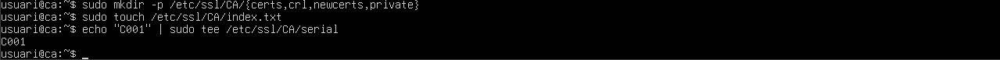

Recreem l’estructura de directoris de la **CA** i reinicialitzem els fitxers index.txt i serial establint el número de sèrie a **001**.

---

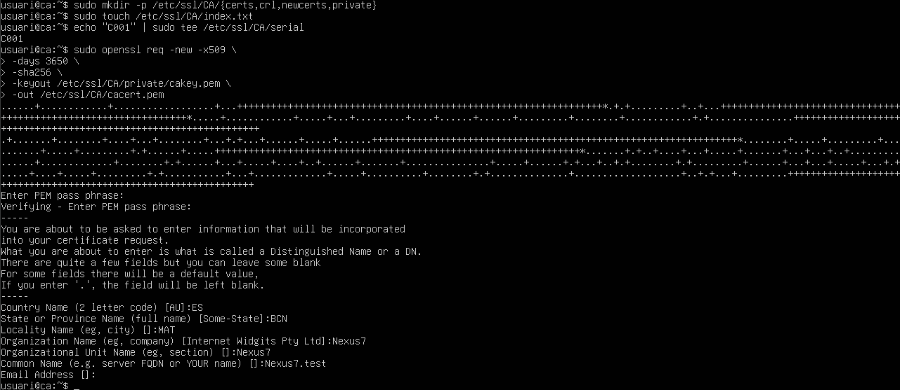

Generem un **certificat autosignat de la CA** utilitzant la clau privada cakey.pem, introduint la contrasenya PEM i omplint les dades del Distinguished Name per crear cacert.pem amb validesa de 3650 dies.

---

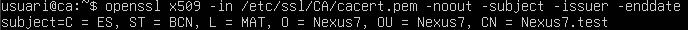

Verifiquem el **subject**, **issuer** i **data de caducitat** del certificat cacert.pem per assegurar-nos que la CA s’ha generat amb les dades correctes.

---

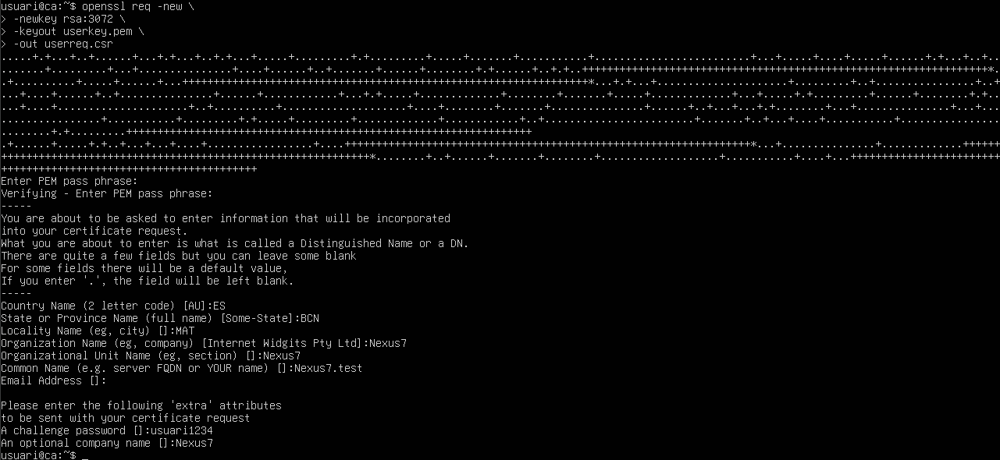

Verifiquem el **subject**, **issuer** i **data de caducitat** del certificat cacert.pem per assegurar-nos que la CA s’ha generat amb les dades correctes.

---

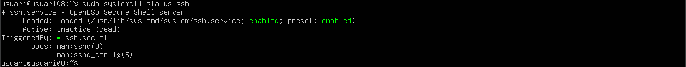

Comprovem l’estat del servei **SSH**, veient que està habilitat però actualment inactiu.

---

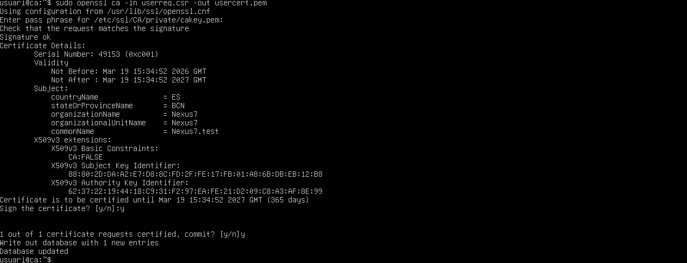

Signem la **sol·licitud de certificat (CSR)** amb la clau de la nostra CA, verifiquem les dades del subjecte i confirmem la signatura per generar el certificat final i actualitzar la base de dades de la CA.

---

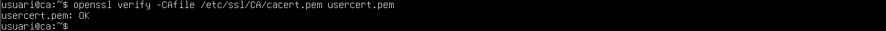

Verifiquem el certificat **usercert.pem** amb la CA cacert.pem, confirmant que és vàlid i està correctament signat.

---

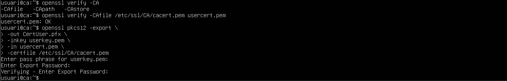

Exportem la clau privada i el certificat d’usuari a un fitxer **PKCS#12 (.pfx)** combinant userkey.pem, usercert.pem i el certificat de la CA, i protegim l’arxiu resultant amb una contrasenya d’exportació.

---

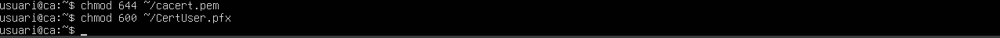

Apliquem els permisos correctes als fitxers **cacert.pem** i **CertUser.pfx**, deixant el certificat públic llegible (644) i el fitxer PFX restringit només al propietari (600).

---

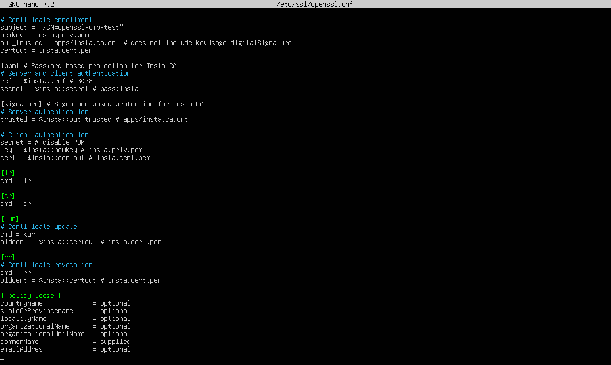

Editem el fitxer **/etc/ssl/openssl.cnf** per definir els paràmetres d’inscripció, autenticació i política que utilitzarà la nostra Autoritat Certificadora.

---
